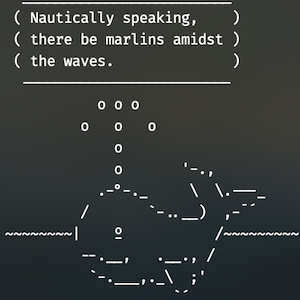
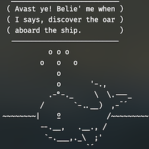
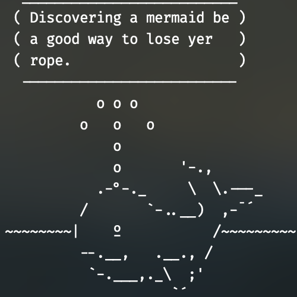

# Melville the Nonsense Whale
Ever wanted a talking whale at the top of your terminal? Me too!
## Installation
>[!IMPORTANT]
>This requires a Unix-like environment with a POSIX-compatible shell (e.g., Bash or Zsh).

Make sure you have a version of cowsay installed that has the cowthink wrapper[^1] (if you're using [Homebrew](https://brew.sh/), run `brew install cowsay`), and put [melville.cow](melville.cow) in your cowsay cowfile directory. You can see where cow files are located by running `cowsay -l`. Then, put the [seababble script](seababble) somewhere you can access. For example, I have it in `$HOME/scripts/Melville-the-Nonsense-Whale`. Finally, add the following two lines to your `.zshrc` or `.bashrc`, making sure `seababble_script` points to the correct path for wherever you put the [seababble script](seababble).
```
seababble_script="$HOME/scripts/Melville-the-Nonsense-Whale/seababble"
"$seababble_script" | cowthink -f melville -W 25 | sed -e 's/^~/~&/' -e 's/^[^~]/ &/'
```
## Explanation
The above command evaluates the seababble script to produce some nautical nonsense, pipes it into cowthink with the melville.cow file specified, tells the cowthink command to wrap the text at 25 columns, and pipes the output to a `sed` command which puts a space in front of every line of the cowthink output which doesn't begin with a tilde (~), and puts a tilde in front of the "seawater" line that does begin with a tilde. This pushes the whole image one column to the right, which I think is visually more pleasant but is not necessary and can be removed without any issues. Now when you open a new terminal tab or window, Melville should be there to keep you company.

>[!NOTE]
> This will run every time you open a new terminal session.

[^1]: Technically, you could just use the `cowsay` command in place of `cowthink`, but my aesthetic preference is for `cowthink`.
