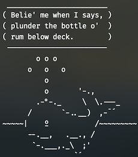
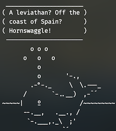

# Melville the Nonsense Whale
Ever wanted a talking whale at the top of your terminal? Me too. Make sure you have cowsay installed (If using [Homebrew](https://brew.sh/): `brew install cowsay`), and put melville.cow in your cowsay cows folder (which you can find with cowsay -l). Then, put the seababble file somewhere you can access and two lines like this in your .zshrc:
```
arr="~/scripts/Melville-the-Nonsense-Whale/./seababble"
eval $arr | cowthink -f melville -W 25
```
Or if using bash, this would probably be 
```
arr=~/scripts/Melville-the-Nonsense-Whale/./seababble
eval "$arr" | cowthink -f melville -W 25
```
